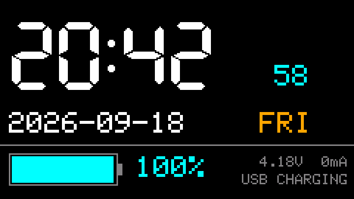
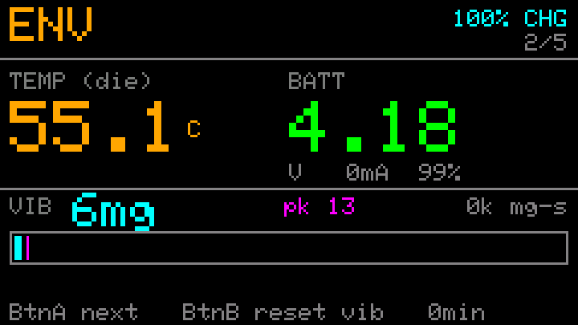
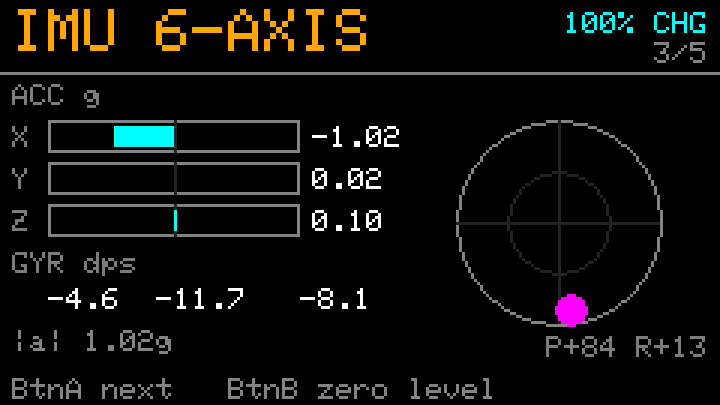
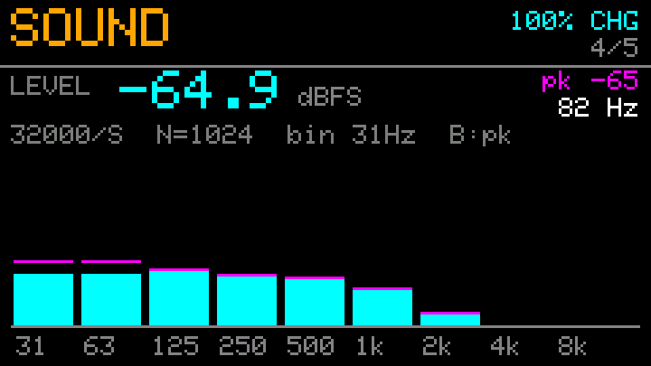
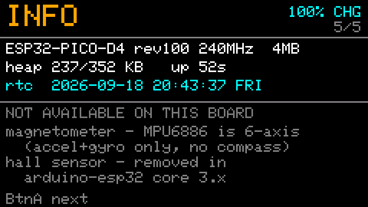

# M5StickC Plus 範例集

一組在 M5StickC Plus（ESP32-PICO-D4）上從零做起的 Arduino 專案，
從最小的 hello world 一路到多頁面儀表、BLE HID 控制器、冷氣紅外線遙控。

每支韌體都在實機上編譯、燒錄、驗證過。



*`07-multiclock` 的 CLOCK 頁。以下所有畫面都不是照片，是從裝置的 sprite 框緩衝
直接倒出來的像素資料（見 [螢幕擷取](#螢幕擷取)）。*

---

## 硬體

| 項目 | 值 |
|---|---|
| 板型 | M5StickC Plus |
| 晶片 | ESP32-PICO-D4 rev v1.0（雙核 240 MHz、WiFi/BT、**無 PSRAM**）|
| Flash | 4 MB（GigaDevice `0xC8` / `0x4016`）|
| 螢幕 | ST7789V2，135×240，1.14 吋 |
| USB-Serial | FTDI FT232R（`VID_0403+PID_6001`）|

### 板載元件

| 元件 | 位置 | 備註 |
|---|---|---|
| AXP192 電源管理 | I2C `0x34`（內部匯流排 SDA21 / SCL22）| 電池電壓、電流、庫侖計、背光 |
| BM8563 RTC | I2C `0x51` | 有獨立供電，斷電不會忘記時間 |
| MPU6886 六軸 + 溫度 | I2C `0x68` | 加速度 + 陀螺儀，**沒有磁力計** |
| SPM1423 PDM 麥克風 | CLK=GPIO0, DATA=GPIO34 | 100 Hz ~ 10 kHz，PDM 時脈 1.0~3.25 MHz |
| 蜂鳴器（被動式）| GPIO2 | 見下方「踩過的坑 #1」|
| 紅色 LED | GPIO10 | 低電位點亮 |
| 紅外線發射 | GPIO9 | **只能發射，板上沒有接收器** |
| 按鍵 | BtnA=GPIO37, BtnB=GPIO39 | 皆為 input-only 腳位 |
| Grove 埠 | SDA=GPIO32, SCL=GPIO33 | 外接 I2C 模組 |
| 擴充排針 | GPIO0/25/26/32/33/36 | GPIO25/26 有 DAC，GPIO36 是 ADC |

### 這塊板子量不到的東西

- **磁場 / 電子羅盤** —— MPU6886 是六軸（加速度 + 陀螺儀），沒有磁力計。
- **ESP32 內建霍爾感測器** —— `hallRead()` 在 arduino-esp32 core 3.x 已被移除。

要量磁場需從 Grove 孔外接（BMM150 / HMC5883L / QMC5883L 之類）。

---

## 專案

| # | 專案 | 內容 |
|---|---|---|
| 01 | `hello_world` | 最小範例。Serial 每秒一行 + LCD 顯示。驗證工具鏈用 |
| 02 | `dashboard` | 單頁儀表：時間 / 溫度 / 電池 / 振動 |
| 03 | `selftest` | 硬體自檢 5 頁：I2C 掃描、系統資訊、WiFi 掃描、麥克風、輸出測試 |
| 04 | `battlog` | 電池續航記錄器，寫入 LittleFS |
| 05 | `blectrl` | BLE HID 鍵鼠複合裝置 + 空中滑鼠 |
| 06 | `acremote` | 日立冷氣紅外線遙控（開 / 關）|
| 07 | `multiclock` | **主要成品**：五頁儀表，含 FFT 頻譜分析 |

### 07 `multiclock` — 五頁儀表

`BtnA` 翻頁 · `BtnB` 執行當頁動作 · 長按 `BtnB` 切換背光

**1 CLOCK** — 時分秒、年月日、星期、電池（%／電壓／電流／充電狀態）


**2 ENV** — 晶片溫度、電池明細、振動即時值 + 峰值 + **累計振動量**（mg·s）



**3 IMU** — 六軸原始值、加速度雙極長條圖、姿態角、**水平儀氣泡**



加速度用雙極長條圖（中央 = 0 g，滿刻度 ±2 g），右側靶心是水平儀：
氣泡偏移量就是傾角，水平時轉綠。上圖中裝置是直立的，所以氣泡壓在底部（P+84°）。

**4 SOUND** — dBFS 音量表、主頻率、**9 段八度頻譜柱狀圖**（31 Hz ~ 8 kHz）



第二行顯示採集設定：`32000/S`（採樣率）、`N=1024`（FFT 點數）、`bin 31Hz`（頻率解析度）。

**採樣率是 32 kHz 而不是 16 kHz**，因為 SPM1423 的響應到 10 kHz：
16 kHz 採樣的 Nyquist 只有 8 kHz，最高的八度頻段落在 2.8~5.7 kHz，
等於丟掉麥克風上面一半的頻寬。32 kHz 把 Nyquist 推到 16 kHz，
才容得下 `8k` 這一段、完整涵蓋元件規格。

PDM 時脈 = 32000 × 64 = **2.048 MHz**，在 SPM1423 的 1.0~3.25 MHz 規格內。
FFT 點數同步提到 1024，頻率解析度才能維持 31.25 Hz 而不是退化成 62.5 Hz。

上圖是安靜房間的實測：低頻高、往高頻單調遞減、4k 與 8k 貼近底線 ——
這是環境噪音典型的粉紅噪音形狀。

**5 INFO** — 系統資訊與「這塊板子量不到什麼」



星期是用 **Zeller 公式從日期算出**，不讀 BM8563 的星期暫存器（那個暫存器從未被設定過，值不可信）。

頻譜用**八度頻段**而非逐 bin 顯示：512 點 FFT 在 16 kHz 下有 256 個 bin，
全畫在 240 px 上只會變成噪訊。人耳以比例感知音高，一個八度一根柱子才讀得出意義。
FFT 只在該頁計算，翻走就停，省 CPU。

### 05 `blectrl` — BLE 控制器

以 `KEYBOARD_MOUSE` 複合 HID 配對（裝置名 `M5Stick Ctrl`，免 PIN）。

| 設定檔 | BtnA | BtnB |
|---|---|---|
| CLICK | ENTER | 滑鼠左鍵 |
| SLIDES | → | ← |
| SCROLL | 滑鼠左鍵 | 滾輪下捲 |
| AIRMOUSE | 左鍵 | 右鍵（長按 = 凍結）|

**空中滑鼠**：水平用陀螺儀 yaw 角速度，垂直用**加速度計傾角**（搖桿式）。

垂直之所以不用陀螺儀：實測發現「上下移動」的手勢在三軸上都沒有獨立訊號 ——
陀螺儀只感測旋轉，把裝置平移上下它完全看不到。改用重力傾角後變成絕對量測，
不漂移、不需大動作、也不會被左右動作干擾。

陀螺儀零偏必須校正（實測 −5 / −12 / −9 dps，不扣掉游標會自己爬走）。

### 06 `acremote` — 冷氣遙控

冷氣遙控器**不送「電源碼」，而是把整台機器的狀態打包成一個長訊框**
（電源 + 模式 + 溫度 + 風速 + 擺葉），日立用過至少 5 種訊框長度
（224 / 104 / 424 / 344 / 264 bit）。

板上沒有紅外線接收器，無法錄原廠遙控器來比對，只能逐一試：
送 `A` 指令會自動把 5 種各發一次（間隔 2 秒），看冷氣在第幾個嗶一聲。

發射距離約 1~3 公尺且需對準（IR LED 由 GPIO 直驅，電流小）。

### 04 `battlog` — 續航測試

無法在插著 USB 時測續航（USB 會一直充電），所以每筆資料寫進內部 flash
（LittleFS，`spiffs` 分割區 896 KB）。

**測法**：充飽 → 拔 USB（自動偵測 VBUS 消失並歸零庫侖計）→ 跑到沒電 → 插回 → 送 `d` 倒出 CSV。

每 10 秒一筆，每筆開檔／寫入／關檔 —— 比較慢，但電池耗盡瞬間最多只掉最後一筆，不會整個檔案損毀。

---

## 建置

### 需要的工具

- [arduino-cli](https://arduino.github.io/arduino-cli/) 1.5.2+
- `m5stack:esp32` core 3.3.9
  （board manager URL：`https://static-cdn.m5stack.com/resource/arduino/package_m5stack_index.json`）

### 需要的函式庫

| 函式庫 | 版本 | 用於 |
|---|---|---|
| M5StickCPlus | 0.1.1 | 全部 |
| ESP32BLECombo + NimBLE-Arduino | 0.1.0 / 2.5.1 | 05 |
| IRremoteESP8266 | 2.9.0 | 06 |
| arduinoFFT | 2.0.4 | 07 |

```bash
arduino-cli core install m5stack:esp32
arduino-cli lib install M5StickCPlus ESP32BLECombo IRremoteESP8266 arduinoFFT
```

### 編譯與燒錄

FQBN：`m5stack:esp32:m5stack_stickc_plus`

```bash
arduino-cli compile --fqbn m5stack:esp32:m5stack_stickc_plus 07-multiclock/multiclock
arduino-cli upload  -p COM3 \
  --fqbn "m5stack:esp32:m5stack_stickc_plus:UploadSpeed=115200" \
  07-multiclock/multiclock
```

> **編譯產物不在版控內**（`build/` 已列入 `.gitignore`，`.elf` 與 `.map` 各約 10 MB）。
> 先 `compile` 再 `upload`。

### ⚠ 上傳速率必須設成 115200

實測這條 FTDI 線在 460800 / 921600 都會斷線，115200 連續讀 4 MB 也會掉 byte。
**Arduino IDE 裡要把 Upload Speed 從預設的 1500000 改掉**，否則燒錄必定失敗，
而且錯誤訊息（`Unable to verify flash chip connection`、`Corrupt data`）看不出真正原因。

---

## `tools/` — PowerShell 序列埠工具

所有韌體都有序列埠指令介面，可以不碰裝置就完成測試。

| 檔案 | 用途 |
|---|---|
| `verify.ps1` | reset 後監看 12 秒 |
| `serial_monitor.ps1` | reset 後監看 60 秒，每行加時間戳 |
| `serial_id.ps1` | 掃描多種鮑率，自動找出正確的那個 |
| `run_selftest.ps1` | 跑完整硬體自檢 |
| `buzzer.ps1` | 只測蜂鳴器 |
| `air.ps1` | 切到空中滑鼠並校正 |
| `aircal.ps1` | 互動式軸向量測（有倒數提示）|
| `pages.ps1` | 多頁面韌體的翻頁驗證 |
| `screenshot.py` | **把螢幕畫面擷取成 PNG**（見下）|

PowerShell 腳本內的 COM 埠寫死為 `COM3`，請依實機修改（`screenshot.py` 用 `--port`）。

### 螢幕擷取

LCD 是唯寫的，讀不回來。但 `multiclock` 的每一頁都先畫進 `TFT_eSprite` ——
一塊真正存在 RAM 裡的 240×135×16bpp 框緩衝 —— 那塊記憶體讀得到。

韌體的 `C` 指令把 sprite 逐行以 base64 送出，**每行附一個檢查碼**：這條 FTDI 線
偶爾會掉 byte，而掉包如果沒被發現，整張圖會從那一行開始錯位。PC 端只用標準庫的
`zlib` 組出 PNG，不需要 Pillow。

```bash
python tools/screenshot.py --page 1        # 指定頁面
python tools/screenshot.py --all           # 五頁全拍
python tools/screenshot.py --scale 1       # 原生 240x135，預設放大 3 倍
```

135 行約 8 秒。有行掉包會自動重試，仍失敗的行留黑並回報行號。

---

## 踩過的坑

### 1. `M5.Beep` 在 core 3.x 完全沒聲音（函式庫 bug）

`M5StickCPlus/src/utility/Speaker.cpp`：

```cpp
void SPEAKER::begin() { ledcAttach(SPEAKER_PIN, 0, 13); }               // 頻率給 0
void SPEAKER::tone(uint16_t f) { ledcWriteTone(TONE_PIN_CHANNEL, f); }  // 傳的是「通道」
```

`SPEAKER_PIN = 2`、`TONE_PIN_CHANNEL = 0`。
**arduino-esp32 3.x 的 `ledcWriteTone()` 第一個參數已從「通道」改成「腳位」**，
所以這行實際是對 GPIO0 寫入，而蜂鳴器接在 GPIO2 —— 永遠不會有聲音。

`begin()` 裡的 `freq = 0` 也是開機那兩行錯誤的來源：

```
E ledc: freq_hz=0 duty_resolution=13
E ledc: ledc_get_duty(740): LEDC is not initialized
```

**解法**：繞過函式庫直接驅動（見 `03-selftest` 的 `buzzerTone()`）。

```cpp
ledcAttach(2, freq, 10);
ledcWriteTone(2, freq);     // 傳腳位
```

### 2. `ScreenBreath()` 參數是 0~100 不是 7~12

舊版 API 收 7~12，這版收百分比。傳 `10` 等於 10% 亮度，螢幕會暗到看不見。

### 3. GPIO34~39 是 input-only

開機的 `gpio_pullup_en(85): input-only pad has no internal PU`
來自函式庫對 BtnB（GPIO39）開內部上拉。不影響功能。

### 4. `hallRead()` 在 arduino-esp32 3.x 已移除

### 5. Arduino 自動原型宣告的插入位置

若函式定義出現在 `struct` 定義之前，自動產生的原型會被插在 struct 前面而編譯失敗
（`'Action' does not name a type`）。把函式定義移到 struct 之後，或手動加前置宣告。

### 6. `convertFan()` 在 IRHitachiAc424 是虛擬成員函式

不能用 `IRHitachiAc424::convertFan(...)` 呼叫，要用物件：`ac424.convertFan(...)`。

### 7. MPU6886 的溫度不是室溫

實測 49~58°C。那是晶片本身的溫度，ESP32 發熱會把它拉高 20~25°C。
要量環境溫度請從 Grove 孔外接（例如 ENV III Unit）。

### 8. 陀螺儀零偏很大

實測靜止時 −5 / −12 / −9 dps。任何要積分陀螺儀的應用都必須先量測並扣除，
否則結果會持續漂移。

### 9. FFT 幅值的 dB 不是 dBFS

頻譜柱高原本用 `(bandDb + 20) / 70` 映射。但 `20*log10(FFT 幅值)` 算的是
**int16 計數的絕對幅值**，不是相對滿刻度：安靜環境各頻段落在 39~60 dB，
滿刻度正弦波經 Hann 窗、1024 點 FFT 後接近 132 dB。

`(60+20)/70 = 1.14` 會被箝到 1.0 —— **開機在安靜房間就已經全部滿格**，整頁失去意義。
改成 `(bandDb - 40) / 70` 之後才看得到真正的頻率響應曲線。

**這個 bug 只看序列埠的數字不會發現**（數字本身是對的），是把畫面擷取成 PNG、
用眼睛看到八根柱子全紅才抓到的。同一批截圖也抓到另外兩處文字重疊。
會畫圖的韌體，值得做個截圖工具。

---

## 授權

MIT
